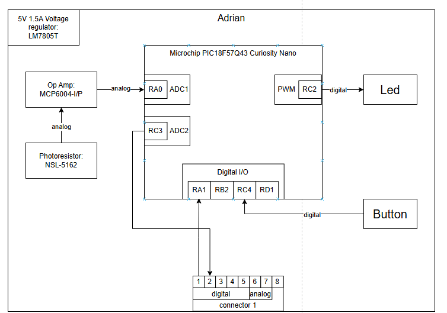

## Overview
This block diagram represents Adrian’s subsystem for the Automatic Curtain Controller project. The design centers on the Microchip PIC18F57Q43 Curiosity Nano, which manages sensor input, signal processing, and output control. Power is supplied by a 5V 1.5A LM7805T voltage regulator, ensuring stable operation for all components. A Photonix NSL-5162 photoresistor detects ambient light levels, and its analog output is amplified by an MCP6004-I/P operational amplifier before being read by the microcontroller’s ADC input (RA0). The microcontroller processes this signal to determine the light intensity and control the system's behavior. A PWM signal from pin RC2 drives an LED indicator, while a digital input on RD1 receives input from a push button for manual control. Communication between this board and the team’s other modules is handled through an 8-pin connector, where pins 1–4 carry digital signals and pins 5–8 handle analog lines. Overall, the subsystem translates light intensity into actionable control signals, maintaining consistent power and reliable communication within the team’s modular design.

## Adrian's Individual Block Diagram 

This block diagram can be found as a PDF [here](Individual_Block_Diagram.drawio.pdf)
