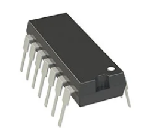
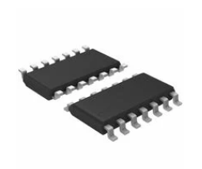
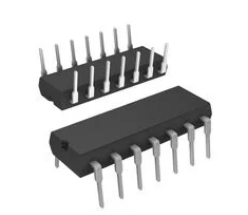
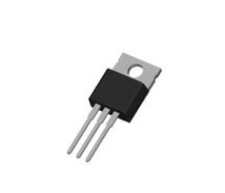
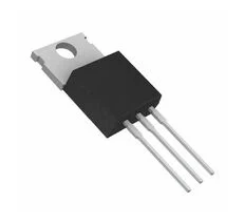
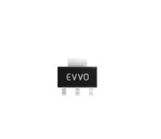
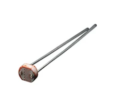
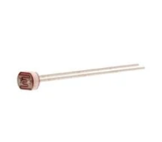
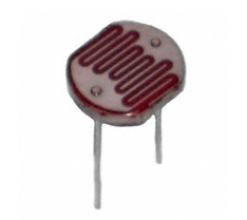

**Op-amp**

| **Solution**                                                                                                                                                                                      | **Pros**                                                                                                                                    | **Cons**                                                                                            |
| ------------------------------------------------------------------------------------------------------------------------------------------------------------------------------------------------- | ------------------------------------------------------------------------------------------------------------------------------------------- | --------------------------------------------------------------------------------------------------- |
|  Option 1.  MCP6004-I/P $0.59/each [link to product](https://www.digikey.com/en/products/detail/microchip-technology/MCP6004-I-P/523060)                                                                                                                                                                   | \* Rail-to-rail I/O \* 1.8–5.5 V supply \* Low quiescent current \* Good for sensors, buffers, or filters                                                                                                                                                                                                         | * 1 MHz GBW (not for high-speed)  \* Limited output drive 
|  \* Option 2.  \* TLV9004IDR  \* $.69/each  \* [Link to product](https://www.digikey.com/en/products/detail/texas-instruments/TLV9004IDR/9674911)                                                                                                                                                         | \* Rail-to-rail  \* 1.8–5.5 V   \* Many footprints | * Often SMD only  \* Similar 1 MHz GBW  \* Availability varies                                                                                                                       |
|  \* Option 3.  \* LM324N  \* $.24/each  \* [Link to product](https://www.digikey.com/en/products/detail/onsemi/LM324N/458682)                                                                                                                                                                              | \* Inexpensive  \* Dual In-line Package   \* Present everywhere | * Not rail-to-rail  \* Input common-mode limits can bite at 3.3 V  \* Vout can’t hit 3.3 V rails   |

**Choice:** Option 1: MCP6004-I/P

**Rationale:** Runs happily at 3.3 V, rail-to-rail I/O, low Iq, DIP package for quick breadboard/proto. It hits the sensor-signal conditioning needs without SMD headaches or excess cost.

**Linear Regulator**

| **Solution**                                                                                                                                                                                      | **Pros**                                                                                                                                    | **Cons**                                                                                            |
| ------------------------------------------------------------------------------------------------------------------------------------------------------------------------------------------------- | ------------------------------------------------------------------------------------------------------------------------------------------- | --------------------------------------------------------------------------------------------------- |
|  Option 1.  LM7805T $0.33/each [link to product](https://www.digikey.com/en/products/detail/taejin/LM7805T/22237260)                                                                                                                                                                                       | \* 5 V fixed  \* Up to ~1 A with heatsinking \* easy to design with | * Big dropout (~2 V): needs ≥7 V in  \* Poor efficiency vs switchers \* Watch thermals
|  \* Option 2.  \* MC7805CTG  \* $.52/each  \* [Link to product](https://www.digikey.com/en/products/detail/onsemi/MC7805CTG/919333)                                                                                                                                                                       | \* Same behavior  \* Widely available    | * Same dropout/thermal limits                    |
|  \* Option 3.  \* AMS1117-5.0  \* $.12/each  \* [Link to product](https://www.digikey.com/en/products/detail/evvo/AMS1117-5-0/24370130)                                                                                                                                                                   | \* Compact  \* Inexpensive | * High dropout (~1.1–1.3 V  \* Only ~800 mA  \* Thermal headroom limited   |

**Choice:** Option 1: LM7805T

**Rationale:** 5 V rail for lab bricks ≥7–9 V input. The design time is near zero, and sourcing is painless. If the input headroom is tight, it can be replaced with an LM2940-5.0.

**Photoresistor**

| **Solution**                                                                                                                                                                                      | **Pros**                                                                                                                                    | **Cons**                                                                                            |
| ------------------------------------------------------------------------------------------------------------------------------------------------------------------------------------------------- | ------------------------------------------------------------------------------------------------------------------------------------------- | --------------------------------------------------------------------------------------------------- |
|  Option 1. Adafruit Photo Cell $0.95/each [link to product](https://www.digikey.com/en/products/detail/adafruit-industries-llc/161/7244927)                                                                                                 | \* Well-documented  \* Simple to integrate in a 3.3 V divider \* Small and inexpensive                                                                                                                                                             | * Not super high precision \*Typical resistance ranges \* May need calibration
|  \* Option 2.  \*Photonix NSL‑5162 CDS Photoresistor \* $1.06/each  \* [Link to product](https://www.digikey.com/en/products/detail/advanced-photonix/NSL-5162/5039797)                                                                     | \*Good industrial pedigree \*Known performance specs  \*Radial through-hole | *Slightly higher cost \*More specs than needed \*Adjustment to the ambient light threshold more than originally intended                    |
|  \* Option 3.  \* Photonix PDV‑P5001 CDS Photoresistor \* $1.54/each  \* [Link to product](https://www.digikey.com/en/products/detail/advanced-photonix/PDV-P5001/480599)                                                                  | \* Larger sensor area (11 mm) \*Could give stronger signal for low-light situations                                                                                                                                                                                                                              | * Bigger package \* Might require different mounting / sensor housing    |

**Choice:** Option 2: Photonix NSL‑5162 CDS Photoresistor

**Rationale:** The NSL-5162 CdS photoresistor was chosen because it offers precise, repeatable light-to-resistance characteristics backed by a detailed datasheet and stable manufacturing. Its wide dynamic range and reliable performance at 3.3 V make it a better long-term, spec-driven choice for consistent ambient-light sensing than hobby-grade LDRs.
