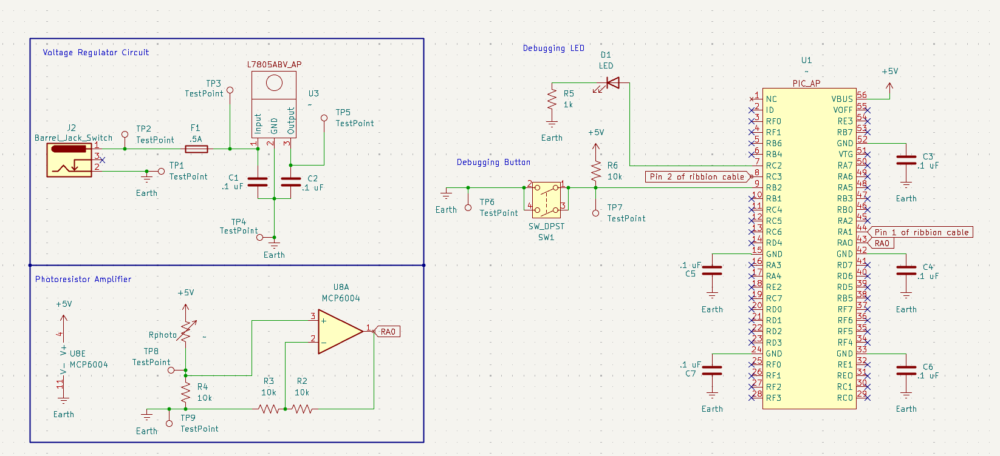

## Overview

This schematic is designed to support a photoresistor amplifier and a PIC Nano microcontroller.

{style width:"350" height:"300;"}
**Figure #1:** Showing current schematic.

## Resouces

The schematic as a PDF download is available [*here*](SubsystemSchematicV2.pdf), and the Zip folder of the project [*here*](SubsystemSchematicV2.zip).
