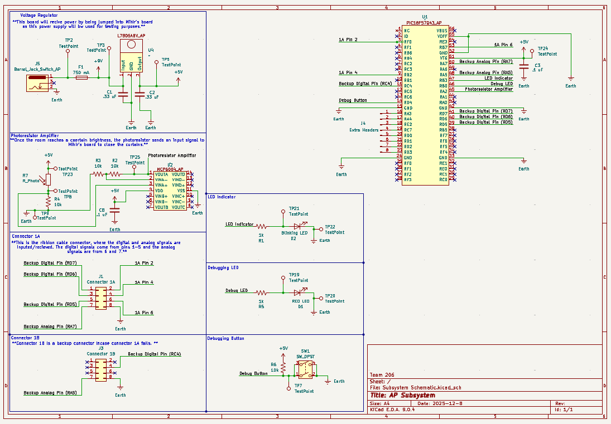

## Overview

This schematic is designed to support a photoresistor amplifier and a PIC Nano microcontroller.

{style width:"350" height:"300;"}
**Figure #1:** Showing current schematic.

## Resouces

The schematic is available for download as a PDF [*here*](Subsystem_Schematic.pdf) and in a zip folder of the project [*here*](AP_Subsystem_Schematic.zip).
