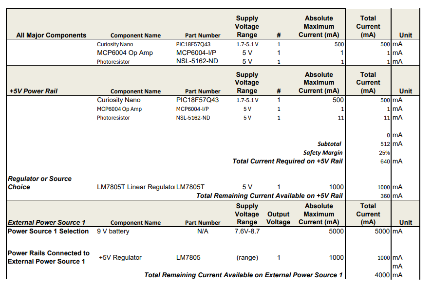

## Overview
After selecting components in the Component Selection phase, we needed to ensure that the subsection would have sufficient power, including an additional safety margin. To achieve this, we focused on the active components, excluding switches and passive components, and confirmed that our power supply and regulators could provide the required power.

## Conclusions

From the prepare Power Budget, .....

## Resouces

The power budget as a PDF download is available [*here*](Power_Budget.pdf), and a Microsoft Excel Sheet [*here*](Power_Budget.xlsx).
