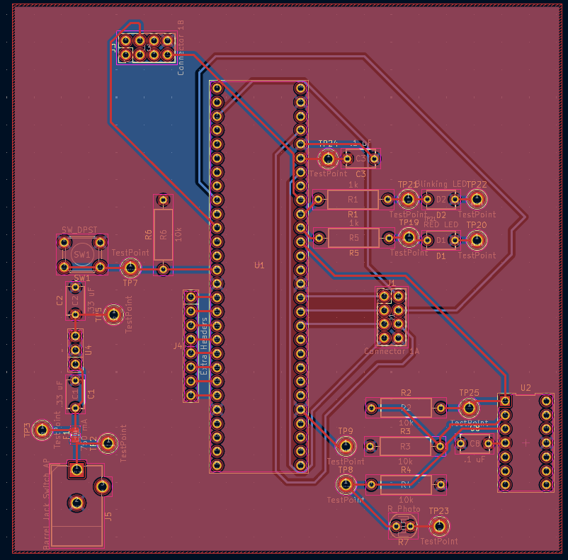
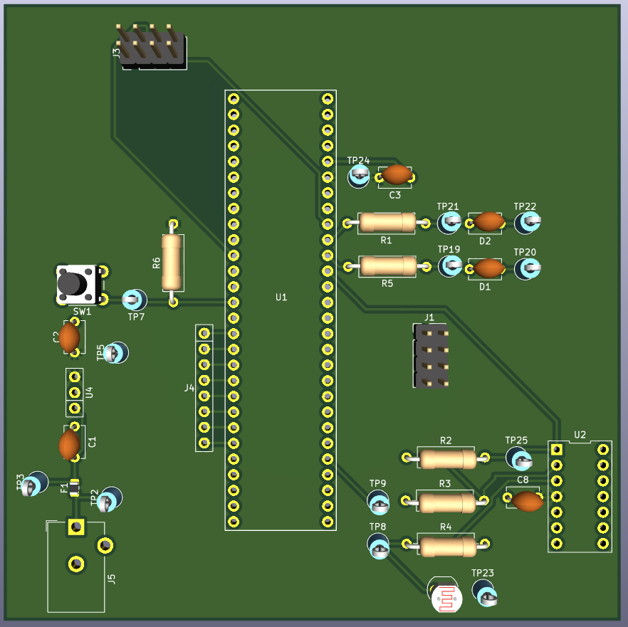

## **Overview**
This is my design of the PCB, including both the top and bottom copper layers.

Figure 1 - Top layer of my PCB

Figure 2 - Bottom layer of my PCB

Figure 3 - ECAD top view

Figure 4 - ECAD bottom view

Figure 5 - Final top view of PCB

Figure 6 - Final bottom view of PCB

## Resources
The 
